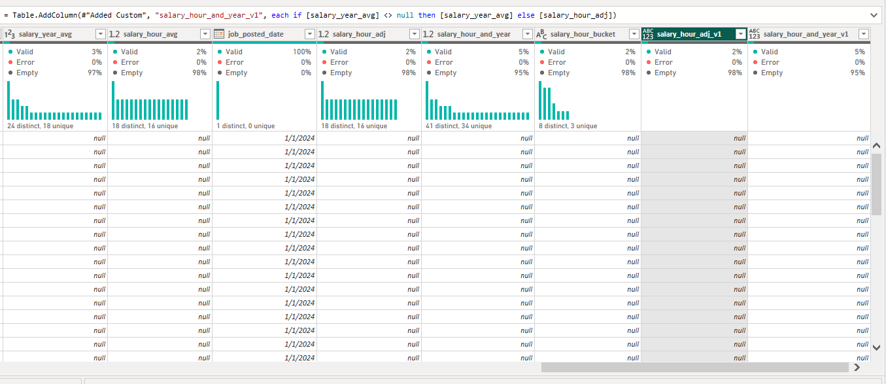
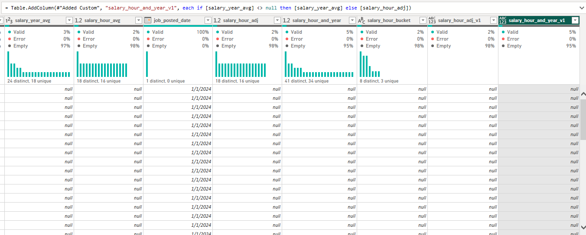
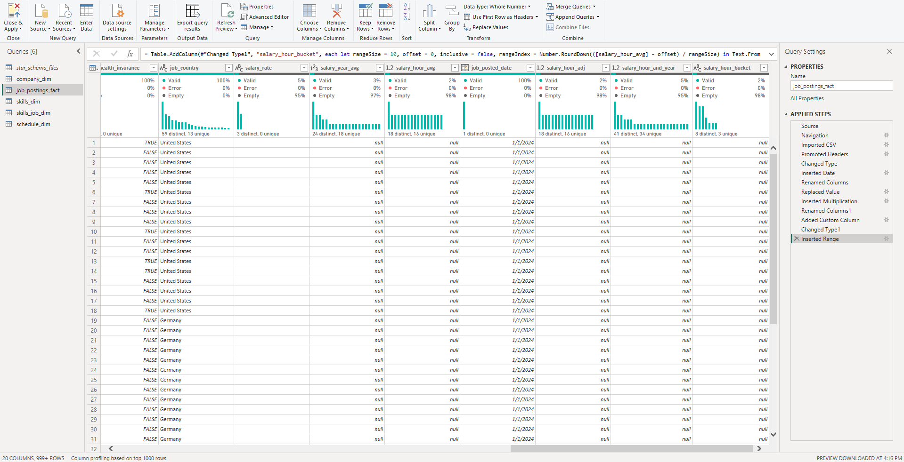
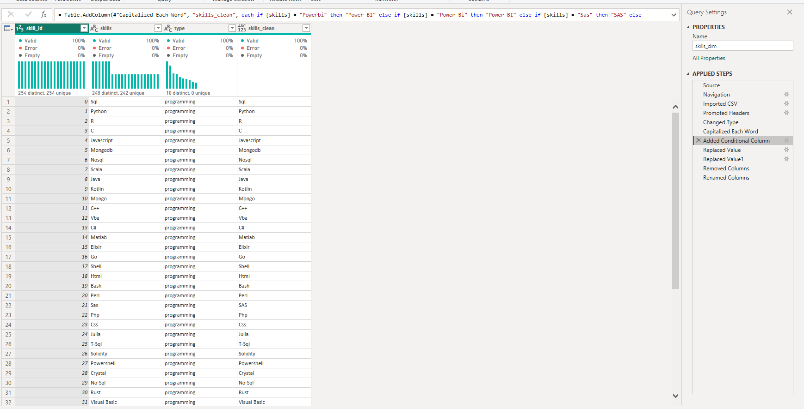
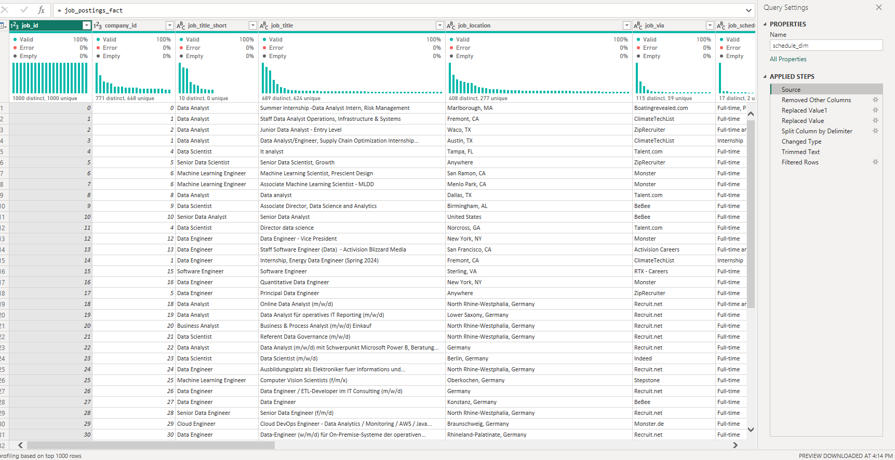
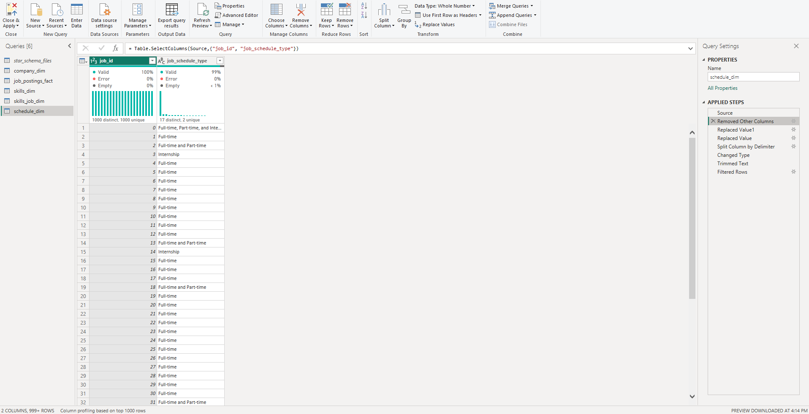
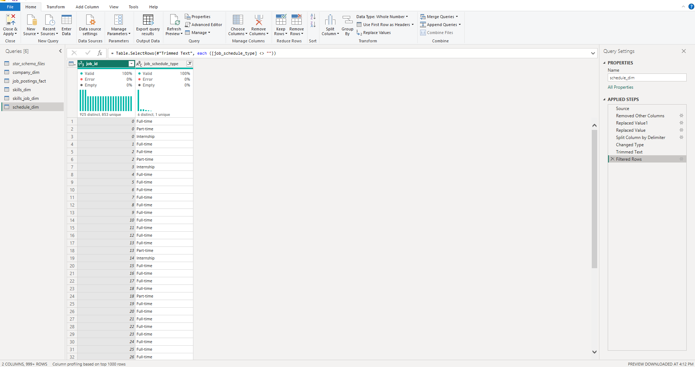
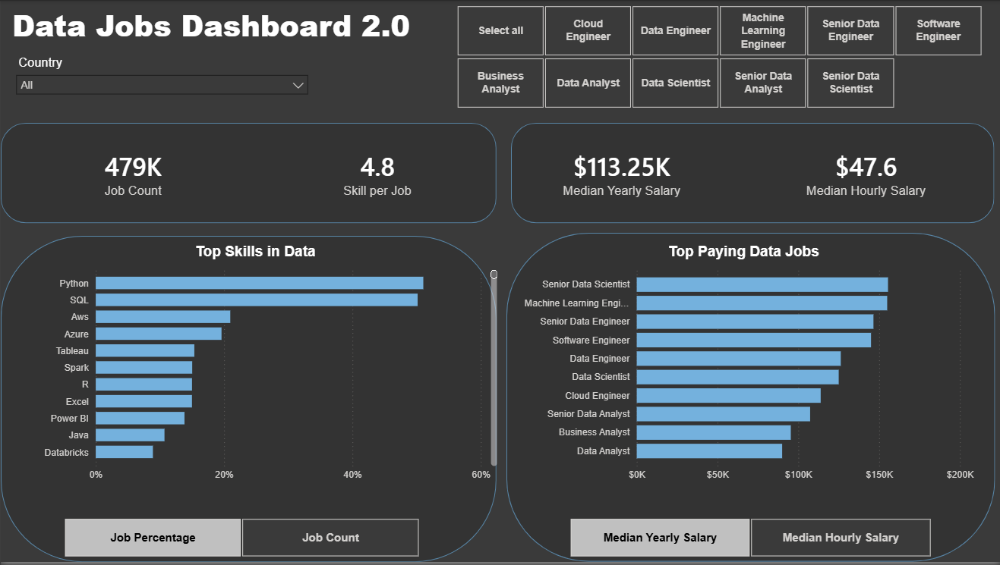

# Data Jobs Dashboard Power BI Project

## Overview

The project focuses on analyzing data jobs using Power BI and demonstrates how raw data can be transformed into a structured, interactive, and insight-driven report.  
It also serves as a portfolio project that highlights not only the final result, but also the technical steps and analytical concepts learned during development.

---

## Project Goal

The main goal of this project was to strengthen my practical Power BI skills by building a report from data preparation to final dashboard presentation.

Through this project, I practiced:

- Cleaning and transforming data in **Power Query**
- Creating **calculated columns**, **measures**, and **calculated tables**
- Understanding **DAX evaluation behavior** and the difference in **context precedence**
- Designing report pages for different analytical questions
- Building interactive report elements and dashboard navigation
- Presenting both the development process and the final dashboard in one report

---

## Report Pages

This report includes multiple pages, each focused on a specific analytical topic or Power BI concept:

- **Company** – analysis related to companies, hiring patterns, and employer-related views
- **Skills** – overview of job-related skills and their frequency or relevance in the dataset
- **Schedule Stats** – analysis of work schedule types and related job posting patterns
- **Salary Stats** – salary-focused analysis using compensation-related fields and comparisons
- **Calculated Table** – page dedicated to demonstrating the use and purpose of calculated tables in the model
- **Measures** – page showing DAX measures used to derive business insights and summary metrics
- **Skills vs Salary** – comparison of skills and salary relationships to explore value across roles or capabilities
- **Parameters** – report page using parameters to support dynamic analysis and user-driven exploration
- **Parameters 2** – additional parameter-based analysis for extended interactivity or alternative report logic
- **Data Jobs Dashboard** – the main dashboard page where key visuals and insights are brought together

By keeping all pages in the final `.pbix` file, the project shows both the **learning structure** and the **final analytical outcome**.

---

## Skills Demonstrated

### Power Query
This project helped me gain practical experience with **Power Query** for ETL and data preparation.  
I worked on cleaning, reshaping, duplicating, renaming, filtering, and simplifying data so it could be used effectively in the report.

Examples of Power Query work in this project include:

- Defining and adjusting salary-related columns
- Cleaning skill-related fields for clearer display
- Creating transformed supporting tables such as schedule-related views
- Removing unnecessary intermediate columns to keep the final model cleaner

### DAX
I also practiced using **DAX** to create measures and support analytical logic inside the report.  
This helped me better understand how calculations behave depending on filters, report context, and visual-level interactions.

Key DAX-related concepts used in this project include:

- Measures for aggregated insights
- Calculated logic for report analysis
- Distinguishing between row context and filter context
- Better understanding of **context precedence** in different reporting scenarios

### Data Modeling
The project also gave me experience with organizing report structure and supporting analysis with model-based logic.  
This included working with calculated tables, supporting dimensions, and pages designed around specific analytical themes.

---

## Screenshots and Development Notes

Below I include screenshots from the project to show not only the final report, but also parts of the transformation and development process.

### Power Query Transformations

 Here, you can see that we used commands to define the `salary_hour_adj_v1` column. Subsequently, both `salary_hour_and_year_v1` and `salary_hour_adj_v1` were deleted for clarity.
At the same time, a useful column, `salary_hour_bucket`, was created; its use will be evident in the hourly pay rankings file. 

A separate part of the work focused on the skills column.
I duplicated the original `skills` column into a new column, `skills_clean`, and applied a series of transformations to it: cleaning, text formatting, and record simplification.
This made the display of skills more accurate and readable in visualizations without altering the source data, which is important for reproducibility and transparency of the processing.

The next steps show the process of building a separate `schedule_dim` table based on the original `job_postings_fact` fact set.
First, the original table was copied; then, filters and transformations were applied in stages to extract only the relevant fields related to schedule types.
Next, this table was simplified and restructured: unnecessary columns were removed, values were grouped, and ultimately it was reduced to a compact format with uniform schedule categories, convenient for use in modeling and visualizations.
Thus, `schedule_dim` became a separate dimension, making the analysis of work schedule types more intuitive and manageable.

### Final Result

#### Here it is workable final Dashboard with Parameters and Slicers!

---

## What I Learned

This project helped me move beyond basic chart creation and better understand how Power BI works as a full analytics tool.

Main learning outcomes:

- How to use **Power Query** for practical ETL and data preparation
- How to write and apply **DAX measures**
- How calculated tables support reporting structure
- How **context precedence** affects calculations and visual behavior
- How to structure a multi-page report for both learning and presentation
- How to combine technical work with dashboard storytelling
- How to create a portfolio-ready Power BI project that shows both process and result

---

## Why I Kept All Pages

I intentionally decided to keep all report pages in this project instead of showing only the final dashboard.

This makes the project more valuable because it reflects:

- My full learning process
- The progression from individual concepts to complete dashboard building
- Practical experimentation with different Power BI features
- A broader range of technical and analytical skills than a single dashboard page alone

---

## Tools Used via Power BI

- **Power Query** for ETL, cleaning, shaping, and transformation
- **DAX** for measures and analytical calculations
- **Calculated Tables** for supporting the report model
- **Charts and Visuals** for analytical storytelling
- **Parameters** for dynamic exploration
- **Multi-page report design** for structured learning and presentation
---

## Conclusion

This project represents my practical learning experience in Power BI through a full, hands-on report-building process.  
By keeping all pages in the final report, I am able to show not only the final dashboard, but also the technical concepts, development steps, and analytical thinking behind it.

It reflects my progress in Power Query, DAX, calculated tables, context handling, report interactivity, and dashboard design, making it an important part of my Power BI portfolio.